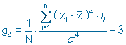

Andrea Elías (carné No.17048 ) <br>
Diego Estrada (carné No. 18540) <br>
Randy Venegas (carné No. 18341) <br>

```{r setup, include=FALSE}
knitr::opts_chunk$set(echo = TRUE)
```


Se indica el path de donde se extrae la información y del informe
```{r}
library(dplyr)
setwd("C:/Users/diego/Documents/Universidad/7mo Semestre/Mineria/HDT1-Mineria-de-Datos")
movies <- read.csv("tmdb-movies.csv",header = TRUE)
```
### 1. Haga una exploración rápida de sus datos, para eso haga un resumen de su conjunto de datos.
Se realiza un summary, función que nos provee un resumen de los datos proporcionados, el cual es de utilidad para conocer la estructura del dataset que se está utilizando.

```{r}
summary(movies)
```
De la misma manera realizamos un head el cual nos proporciona los primeros  registros de cada variable del dataset, dándonos así un panorama más claro del tipo de datos con el que se está trabajando.
```{r}
head(movies)
```

### 2. Diga el tipo de cada una de las variables (cualitativa ordinal o nominal, cuantitativa continua, cuantitativa discreta)
```{r}
glimpse(movies)
```
Cualitativas: original_title, cast, homepage, director, tagline, keywords, overview,genres, production_companies, release_date, release_year, <br>
Cuantitativas: <br>popularity, budget, revenue, runtime, vote_count, vote_average, revenue_adj, budget_adj
<br>

### 3. Investigue si las variables cuantitativas siguen una distribución normal y haga una tabla de frecuencias de las variables cualitativas. Explique todos los resultados
##### Variables cuantitativas.
Para este inciso propusimos usar una medida de asimetría, la curtosis. Esta medida se encarga de medir la concentración de los datos en torno a la media. Este coeficiente es medido por la fórmula:<br> 

<br> cuando el coeficiente resulta ser 0, se dice entonces que la distribución es normal, también conocida como mesocúrtica; si es menor a cero, es decir negativo, se dice que la distribución es platicúrtica y que los datos no están concentrados alrededor de la media; si el coeficiente es mayor a 0, es decir que es positivo, se le dice leptocúrtica, y que los datos están más concentrados en torno a la media. 1
<br>

Todas las variables cuantitativas para la base de datos de movies resultaron con un coeficiente de curtosis positivo, es decir, con una distribución leptocúrtica. De acuerdo con la imagen de arriba, únicamente la variable de vote_average posee un coeficiente de curtosis muy cercano a 0 (0.542), por lo que se puede concluir que esta si posee una distribución normal. A continuación se presenta un histograma de la variable antes mencionada, en la que se puede ver claramente como los datos se concentran de forma normal alrededor de la media, tomando una forma de campana:

```{r}
library(e1071)
## Popularidad
popularity = movies$popularity
kurtosis(popularity)

#Presupuesto
budget = movies$budget
kurtosis(budget)

#Ingresos
revenue = movies$revenue
kurtosis(revenue)

#Duración
runtime = movies$runtime
kurtosis(runtime)

#Votos
vote_count = movies$vote_count
kurtosis(vote_count)

#Promedio de votos
vote_average = movies$vote_average
kurtosis(vote_average)
hist(vote_average)

#Ajuste de ingresos
revenue_adj = movies$revenue_adj
kurtosis(revenue_adj)

#Ajuste de presupuesto
budget_adj = movies$budget_adj
kurtosis(budget_adj)
```

##### Variables cualitativas
Para las variables cualitativas se realizaron tablas de frecuencia, mismas que permitieron observar la predominancia de géneros, actores, directores, taglines, palabras clave, entre otras. En el caso de las variables id e imdb_id, no se realizaron tablas de frecuencia ya que no aportan al análisis estadístico, especialmente porque estos valores suelen ser únicos (frecuencia 1). Al realizar este proceso, fue posible notar que varios campos de estas variables estaban vacíos, entonces se procedió a rellenarlos con el valor N/A, y posteriormente excluidos. Otro caso particular, fue que algunos campos contenían varios valores separados por “|”, para lo cual fue necesario realizar un separate por la cadena “|” con el fin de contar estos valores de manera individual y no colectiva.

```{r}
library(tidyr)

#Titulo
original_title <- data.frame(table(movies$original_title))

#Reparto
cast <- data.frame(table(do.call(c, lapply(movies$cast, function(x) unlist(strsplit(x, "\\|"))))))

#Pagina
homepage <- data.frame(table(movies$homepage))
homepage[homepage == ""] <- NA
homepage <- na.omit(homepage)

#Director
director <- data.frame(table(movies$director))
director[director == ""] <- NA
director <- na.omit(director)

#Tagline
tagline <- data.frame(table(movies$tagline))
tagline[tagline == ""] <- NA
tagline <- na.omit(tagline)

#Palabras clave
keywords <- data.frame(table(do.call(c, lapply(movies$keywords, function(x) unlist(strsplit(x, "\\|"))))))

#Sinopsis
overview <- data.frame(table(movies$overview))
overview[overview == ""] <- NA
overview <- na.omit(overview)

#Generos
genres <- data.frame(table(do.call(c, lapply(movies$genres, function(x) unlist(strsplit(x, "\\|"))))))

#Companias de produccion
production_companies <- data.frame(table(do.call(c, lapply(movies$production_companies, function(x) unlist(strsplit(x, "\\|"))))))

#anio
release_year <- data.frame(table(movies$release_year))
#fecha
release_date <- data.frame(table(movies$release_date))
```

### 4.1. ¿Cuáles son las 10 películas que contaron con más presupuesto?
```{r}
budget<-movies[with(movies,order(-movies$budget)),1:6]
head(budget,10)
```

### 4.2. ¿Cuáles son las 10 películas que más ingresos tuvieron?
```{r}
budget<-movies[with(movies,order(-movies$revenue)),1:6]
head(budget,10)
```

### 4.3. ¿Cuál es la película que más votos tuvo?
```{r}
budget<-movies[with(movies,order(-movies$vote_count)),1:6]
head(budget$original_title,1)
```

### 4.4.¿Cuál es la peor película de acuerdo a los votos de todos los usuarios?
```{r}
budget<-movies[with(movies,order(movies$vote_average)),1:6]
head(budget$original_title,1)
```

### 4.5.¿Cuántas  películas  se  hicieron  cada  año?¿En qué año  se  hicieron  más películas? Haga un gráfico de barras
```{r}
movies$cuenta <- 1
years <- aggregate (movies$cuenta, by = list(movies$release_year), FUN = sum)
vec <- c (years)

colors = c("black","red","blue","grey","orange","pink","purple")
barplot(vec$x, names.arg = vec$Group.1, xlab = "año", ylab ="Cantidad de Licas",main = "Promedio de perdidas",col=colors)
```

### 4.6.¿Cuál es el género principal de las 20 películas más populares?
```{r}
popularity<-movies[with(movies,order(-movies$popularity)),]
head(popularity$genres,20)

library(tidyr)
category<-popularity %>%separate(genres,c("categoria1","categoria2","categoria3","categoria4"),sep="\\|")
head(category$categoria1,20)
```

### 4.7. ¿Cuál es el género que predomina en el conjunto de datos? 
```{r}
graph <-aggregate(category$cuenta, by=list(category$categoria1), FUN=sum)
vec <- c(graph)

colors = c("black","red","blue","grey","orange","pink","purple")
barplot(vec$x, names.arg = vec$Group.1, xlab = "Genero", ylab ="Frecuencia",main = "¿Cuál es el género que predomina en el conjunto de datos? ",col=colors)
```
<br>
El género que predomina en el conjunto de datos es Drama
<br>

### 4.8. ¿Las películas de qué género principal obtuvieron mayores ganancias?
```{r}
ganancias<-aggregate(category$revenue, by=list(category$categoria1), FUN=sum)
ganancias
```
<br>
Las películas de acción fueron las que obtuvieron más ganancias.
<br>

### 4.9. ¿Las películas de qué género principal necesitaron mayor presupuesto?
```{r}
presupuesto2<-aggregate(category$budget, by=list(category$categoria1), FUN=sum)
presupuesto2
```
<br>
Las películas de acción fueron las que requirieron de mayor presupuesto.
<br>

### 4.10. ¿Quiénes son los 20 mejores directores que hicieron películas altamente calificadas?
```{r}
votaciones<-category[with(category,order(-category$vote_average)),]
top20 = head(votaciones,30)
director<-aggregate(top20$vote_average, by=list(top20$director), FUN=sum)
director
```

### 4.11. ¿Cómo se correlacionan los presupuestos con los ingresos? ¿Los altos presupuestos significan altos ingresos? Haga los gráficos que necesite, histograma, diagrama de dispersión
```{r}
ingresos <-data.frame(movies$budget,movies$revenue, movies$original_title)

library(MASS)
cor(x=ingresos[,1], y=ingresos[,2])

plot(ingresos[,1], ingresos[,2], main="¿Cómo se correlacionan los presupuestos con los ingresos? " ,xlab="Budget", ylab="Revenue")
abline(lm(ingresos[,2]~ingresos[,1]), col="pink")
```
<br>
Con base en los resultados y el resultado del índice de correlación obtenido, se puede concluir que existe una correlación positiva entre el presupuesto y las ganancias. Interpretando la gráfica se puede inferir que con un presupuesto a partir de los $100 millones el valor del presupuesto no tiene un efecto significativo sobre las ganancias, mientras que si este rodea los $300 millones hay una posibilidad más alta de obtener mayores ganancias. Por otro lado, también es importante notar que cuando un filme supera un presupuesto de $300 millones las posibilidades de tener pérdidas se ven en aumento.
<br>

### 4.12. ¿Se asocian ciertos meses de lanzamiento con mejores ingresos?
```{r}
month<-movies %>%separate(release_date,c("mes","dia","anio"),sep="\\/")
ingresos1<-aggregate(month$revenue, by=list(month$mes), FUN=mean)
ingresos1
vectorGraph <-(ingresos1)
colors = c("black","red","blue","grey","orange","pink","purple")
barplot(vectorGraph$x, names.arg = vectorGraph$Group.1, xlab = "mes", ylab ="ganancias", col=colors)
```
<br>
En la tabla y gráfica adjunta, podemos observar las ganancias promedio obtenidas por mes, donde se puede observar que en cada mes hay diferente cantidad de ganancias por lo que podemos decir que si se pueden asociar ciertos meses a los mejores ingresos siendo en este caso, el mes de junio el más favorecido y enero el mes en el que se obtuvieron las ganancias menores.
<br>

### 4.13. ¿En qué meses se han visto los lanzamientos máximos?
```{r}
library(tidyr)
month<-movies %>%separate(release_date,c("mes","dia","anio"),sep="\\/")
sort(table(month$mes), decreasing = TRUE)
```
<br>
El mes con más lanzamientos fue septiembre (9) con 1331, seguido por octubre y diciembre, con 1153 y 985 respectivamente. Se puede intuir que en los últimos meses del año los lanzamientos incrementan.
<br>

### 4.14. ¿Cómo se correlacionan las calificaciones con el éxito comercial?
```{r}
exito<-data.frame(movies$revenue,movies$popularity, movies$original_title)
plot(exito[,2], ingresos[,1], main="Diagrama de Dispersion", xlab="Popularity", ylab="Revenue")
abline(lm(ingresos[,1]~exito[,2]), col="blue")
```
<br>
Con el diagrama de dispersión anterior, se concluye que no existe correlación entre las ganancias y la popularidad de un filme. Es posible observar que los puntos se alejan mucho de la línea de regresión.
<br>

### 4.15. ¿A qué género principal pertenecen las películas más largas?
```{r}
longtime<-category[with(category,order(-category$runtime)),]
head(longtime$categoria1,10)
```